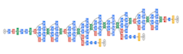
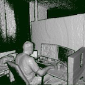
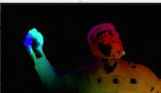

OpenCV 4.0 相比于 3.0 版本有哪些变化呢？

1.OpenCV 4.0 使用了 C++ 11 新特性，迁移到 C++ 11 意味着打破“二进制兼容性承诺”。OpenCV 3 用的是 C++ 98 库，而许多 C++ 开发人员切换到了 C++ 11 或者更新的版本。

2.将Halide库作为OpenCV的一部分。

3.OpenCV 4.0 更新了大量的模块和库。现在是深度学习的时代，Open CV 4.0 强化了 DNN 模块并添加支持 ONNX 交换格式的神经网络。

4.去掉了很多 C 风格的 API，并添加了 G-API 模块。优化了持久层，加载和处理数据更快了。3D 对象扫描与模型创建流行算法 Kinect Fusion algorithm 已经被实现并集成在 4.0 中。


- OpenCV is now C++11 library and requires C++11-compliant compiler. Minimum required CMake version has been raised to 3.5.1.
- A lot of C API from OpenCV 1.x has been removed.
- Persistence (storing and loading structured data to/from XML, YAML or JSON) in the *core* module has been completely reimplemented in C++ and lost the C API as well.
- New module G-API has been added, it acts as an engine for very efficient graph-based image procesing pipelines.
- *dnn* module was updated with [Deep Learning Deployment Toolkit](https://github.com/opencv/dldt) from the OpenVINO™ toolkit R4. See [the guide](https://github.com/opencv/opencv/wiki/Intel's-Deep-Learning-Inference-Engine-backend) how to build and use OpenCV with DLDT support.
- *dnn* module now includes experimental Vulkan backend and supports networks in ONNX format.
- The popular Kinect Fusion algorithm has been implemented and optimized for CPU and GPU (OpenCL)
- QR code detector and decoder have been added to the *objdetect* module
- Very efficient and yet high-quality DIS dense optical flow algorithm has been moved from opencv_contrib to the *video*module.


 4.0 alpha includes all the latest improvements, optimizations and bug fixes from 3.4 branch. In particular:

- ONNX parser has been added to OpenCV DNN module. It supports various classification networks, such as AlexNet, Inception v2, Resnet, VGG etc. The tiny YOLO v2 object detection network is also partially supported.

- A few other notable DNN improvements:

- - Mask RCNN support and the example
  - Faster object detection when using Intel Inference Engine (a part of Intel OpenVINO)
  - Several stability improvements in the OpenCL backend.

- Fast QR code detector (~80FPS @ 640x480 resolution on Core i5 desktop). By 4.0 gold we plan to add the QR code decoder as well, so that we have a complete solution.

- Constantly expanding set of SSE4-, AVX2- and NEON-optimized kernels via so called “wide universal intrinsics”.

Besides, OpenCV 4.0 alpha includes some exclusive features, such as:

- OpenCV is C++11 library now and it requires C++11 compliant compiler. Therefore, some nice features like parallel_for with lambda functions, convenient iteration over cv::Mat, initialization of cv::Mat by listing its elements etc. are available by default.
- The standard `std::string` and `std::shared_ptr` replaced hand-crafted `cv::String` and `cv::Ptr`. Our parallel_for can now use the pool of std::threads as the backend.
- The legacy C API from OpenCV 1.x (using `CvMat`, `IplImage`, etc.) is partially excluded; the cleanup should mostly be finished by OpenCV 4.0 gold.
- Added basic FP16 support (the new `CV_16F` type has been added).
- CPU- and GPU-accelerated KinFu live 3d dense reconstruction algorithm has been included into *opencv_contrib*.
- HPX parallel backend (thanks to Jakub Golinowski)
- The new chessboard detector (thanks to Alexander Duda)


OpenCV 4.0 Beta includes 29 new patches, including massive merges from 3.4 branch, since OpenCV 4.0 alpha (<https://opencv.org/opencv-4-0-0-alpha.html>):

- ONNX* (Open Neural Network Exchange) importer has been further improved to support more topologies.
- OpenCV DNN sample object_detection.py has been improved to fill in the right model parameters, so it’s much easier to use now.
- G-API (Graph API) - super-efficient image processing pipeline engine has been integrated as [opencv_gapi module](https://github.com/opencv/opencv/tree/master/modules/gapi)
- Fast QR code decoder, based on free QUirc (<https://github.com/dlbeer/quirc>) library has been integrated, so now we have a complete QR-code detection and decoding pipeline (that runs ~20-80FPS @ 640x480 resolution).
- 18 functions, over 60 kernels have been accelerated for AVX2 using “wide universal intrinsics.”
- Kinect Fusion algorithm has been accelerated for iGPU, which resulted in ~3x speedup over parallel CPU version on high-resolution volume (512x512x512).
- Implementation of The Fast Bilateral Solver made by [Kuan Wang](https://github.com/THUKey) for GSoC 2017 has been integrated to *opencv_contrib*, thanks to [@berak](https://github.com/berak)


OpenCV 4.0 RC includes ~60 [new patches](https://github.com/opencv/opencv/pulls?page=1&q=is%3Apr+merged%3A2018-10-17..2018-11-12+base%3Amaster&utf8=%E2%9C%93) since [OpenCV 4.0 beta](https://opencv.org/opencv-4-0-0-beta.html):

- Experimental Vulkan backend have been added to the *dnn* module, thanks to Zhiwen Wu and Juan J. Zhao.
- *opencv_stitching* module interface has been refactored, thanks to Jiri Horner.
- More accurate camera calibraion method have been implemented, thanks to Wenfeng CAI.
- Persistence part of the *core* module (storing data in XML/YML/JSON formats) has been rewritten in C++ and consumes less memory when reading `FileStorage`. The C API (`CvFileStorage`) has been removed.
- Graph API module has been extended: it recieved initial heterogenity support, OpenCL support, better documentation, ability to build it standalone. Thanks to Dmitry Matveev, Dmitry Budnikov and other G-API folks!
- Some more of obsolete C-API has been removed in the following modules: *photo*, *video*, *imgcodecs*, *videoio*
- Dropped obsolete *videoio* and *highgui* backends: QuickTime, QTKit, Unicap, Video for Windows, libv4l, DC1394_V1, Carbon
- *shape*, *superres*, *videostab*, *viz* modules and TVL1 optical flow algorithm were moved to *opencv_contrib*
- DIS optical flow algorithm, implemented by Alexander Bokov, has been moved to the main repository from *opencv_contrib*.
- Some latest changes in 3.4 branch have been merged to the master, including updated libpng (security fixes), XCode 10 support, Turing GPU support, many optimizations and bug fixes

//=============================================================

---------

-----

----


# OpenCV Change Logs

## version:4.0.1

*December, 2018*

New Year's update for OpenCV 4.0 has been released.

### Contributors


## version:3.4.5

*December, 2018*

OpenCV 3.4.5 has been released. Bug fixes, optimizations and other enhancements are propagated into OpenCV 4.0.1.

## version:4.0.0

**4.0.0-alpha**: *September, 2018*

**4.0.0-beta**: *October, 2018*

**4.0.0 final**: *November, 2018*

We are glad to announce OpenCV 4.0 release.

Here is what's new:


- A lot of C API from OpenCV 1.x has been removed. The affected modules are objdetect, photo, video, videoio, imgcodecs, calib3d.
- Persistence (storing and loading structured data to/from XML, YAML or JSON) in the core module has been completely reimplemented in C++ and lost the C API as well. For now base64 support is not complete (only loading base64-encoded XML and YAML is supported, encoding is not supported at all). Also, the random access of sequences stored in a `FileNode` is now a slow O(N) operation vs. fast O(1) in the previous implementation; use `cv::FileNodeIterator` for much faster sequential access. On the positive side, the loaded `FileStorage`'s take 3-6x less memory than in the previous implementation.
- OpenCV is now C++11 library and requires C++11-compliant compiler. Note that OpenCV 3.x can also be built as C++11 library by passing `-DENABLE_CXX11=ON` flag to CMake. Now this is the only option so the flag is not needed and is not available anymore.
  - Thanks to the extended C++11 standard library, we could get rid of hand-crafted `cv::String` and `cv::Ptr`. Now `cv::String == std::string` and `cv::Ptr` is a thin wrapper on top of `std::shared_ptr`. Also, on Linux/BSD for `cv::parallel_for_` we now use `std::thread`'s instead of pthreads.

 

- DNN improvements

  - Added support for Mask-RCNN model. Follow a [guide](https://github.com/opencv/opencv/wiki/TensorFlow-Object-Detection-API) and use a [python sample](https://github.com/opencv/opencv/blob/master/samples/dnn/mask_rcnn.py).

  - Integrated ONNX parser. We now support many popular classification networks. YOLO object detection network in partially supported as well (ONNX version of YOLO lacks some final layers that actually give you the list of rectangles). Thanks to [Lubov Batanina](https://github.com/l-bat) for her first-time contribution to OpenCV!

  - Further improved performance of DNN module when it's built with [Intel DLDT](https://software.intel.com/openvino-toolkit) support by utilizing more layers from DLDT. By the way, DLDT has been recently released as [open-source](https://github.com/opencv/dldt). See [the guide](https://github.com/opencv/opencv/wiki/Intel's-Deep-Learning-Inference-Engine-backend) how to build and use OpenCV with DLDT support.

  - API changes: by default, `blobFromImage` methods family do not swap red and blue channels and do not crop the input image. Beware that this API change has also been propagated to OpenCV 3.4 branch.

  - Experimental Vulkan backend has been added for the platforms where OpenCL is not available: <https://github.com/opencv/opencv/pull/12703>. Thanks to Zhiwen Wu and Juan J. Zhao for the contribution!

  - Added shortcuts for the most popular deep learning networks supported by OpenCV. You may specify an alias name of model to skip pre-processing parameters and even paths to models! In example, instead of

    ```
    python object_detection.py --model opencv_face_detector.caffemodel --config opencv_face_detector.prototxt --mean 104 177 123 --width 300 --height 300
    ```

    you can type just

    ```
    python object_detection.py opencv_fd
    ```

  - Fixed OpenCL acceleration on AMD and NVIDIA GPUs. Now you may enable `DNN_TARGET_OPENCL` for your model without extra environment variables. Please note that `DNN_TARGET_OPENCL_FP16` is tested on Intel GPUs only, so it still requires additional flags.


- Completely new module [opencv_gapi](https://github.com/opencv/opencv/tree/master/modules/gapi) has been added. It is the engine for very efficient image processing, based on lazy evaluation and on-fly construction of the processing graph (hence the name Graph API or G-API). See [Graph API (G-API)](https://github.com/opencv/opencv/wiki/Graph-API) for details.


- Performance improvements
  - A few hundreds of basic kernels in OpenCV have been rewritten using so-called "wide universal intrinsics". Those intrinsics map to SSE2, SSE4, AVX2, NEON or VSX intrinsics, depending on the target platform and the compile flags. It should translate to noticeably better performance, even for some already optimized functions. For example, if you configure and compile OpenCV with `CPU_BASELINE=AVX2` CMake flag, you can get extra 15-30% speed improvement for certain image processing operations. By OpenCV 4.0 gold we plan to translate many more kernels to such intrinsics and also employ our dynamic dispatching mechanism, so that on x64 platform AVX2-optimized kernels are always built-in and could be selected on-fly if the actual hardware supports such instructions (without having to change `CPU_BASELINE`). Big thanks to Sayed Adel for VSX backend and the initial (but rather complete!) AVX2 backend of the wide universal intrinsics! Big thanks to Vitaly Tuzov for conversion of many functions in OpenCV to wide universal intrinsics.
  - Support for IPP 2019 has beed added with IPPICV component upgrade.


- QR code detector and decoder have been added to opencv/objdetect module together with live [sample](https://github.com/opencv/opencv/blob/master/samples/cpp/qrcode.cpp). Currently, the decoder is built on top of QUirc library (which snapshot we put into opencv). Thanks to our intern Alexander Nesterov for this important contribution!



- The popular Kinect Fusion algorithm has been implemented, optimized for CPU and GPU (OpenCL), and integrated into opencv_contrib/rgbd module. To make the live [sample](https://github.com/opencv/opencv_contrib/blob/master/modules/rgbd/samples/kinfu_demo.cpp) work, we updated our Kinect 2 support in opencv/videoio module. In 4.0 beta the code has been accelerated for iGPU, which resulted in 3x performance boost in the high-resolution case (512x512x512 integration volume). Thanks to Rostislav Vasilikhin for the excellent work!



- Very efficient and yet high-quality DIS dense optical flow algorithm has been moved from opencv_contrib to opencv, video module. See the [example](https://github.com/opencv/opencv/blob/master/samples/cpp/dis_opticalflow.cpp). Thanks to Alexander Bokov, our GSoC student, who implemented this algorithm, and Peng Li, who optimized it for GPU.
- At the same time, slower TV L1 optical flow algorithm has been moved from opencv to [opencv_contrib](https://github.com/opencv/opencv_contrib/tree/master/modules/optflow).

### Contributors

<details style="box-sizing: border-box; display: block; margin-bottom: 16px; margin-top: 0px; color: rgb(36, 41, 46); font-family: -apple-system, BlinkMacSystemFont, &quot;Segoe UI&quot;, Helvetica, Arial, sans-serif, &quot;Apple Color Emoji&quot;, &quot;Segoe UI Emoji&quot;, &quot;Segoe UI Symbol&quot;; font-size: 16px; font-style: normal; font-variant-ligatures: normal; font-variant-caps: normal; font-weight: 400; letter-spacing: normal; orphans: 2; text-align: start; text-indent: 0px; text-transform: none; white-space: normal; widows: 2; word-spacing: 0px; -webkit-text-stroke-width: 0px; background-color: rgb(255, 255, 255); text-decoration-style: initial; text-decoration-color: initial;"><summary style="box-sizing: border-box; display: list-item; cursor: pointer;">opencv (155 contributors)</summary></details>

<details style="box-sizing: border-box; display: block; margin-bottom: 16px; margin-top: 0px; color: rgb(36, 41, 46); font-family: -apple-system, BlinkMacSystemFont, &quot;Segoe UI&quot;, Helvetica, Arial, sans-serif, &quot;Apple Color Emoji&quot;, &quot;Segoe UI Emoji&quot;, &quot;Segoe UI Symbol&quot;; font-size: 16px; font-style: normal; font-variant-ligatures: normal; font-variant-caps: normal; font-weight: 400; letter-spacing: normal; orphans: 2; text-align: start; text-indent: 0px; text-transform: none; white-space: normal; widows: 2; word-spacing: 0px; -webkit-text-stroke-width: 0px; background-color: rgb(255, 255, 255); text-decoration-style: initial; text-decoration-color: initial;"><summary style="box-sizing: border-box; display: list-item; cursor: pointer;">opencv_contrib (43 contributors)</summary></details>

## version:3.4.4

*November, 2018*

OpenCV 3.4.4 has been released. This is a mantenance release. New features are landed in OpenCV 4.0.

## version:3.4.3

*August, 2018*

OpenCV 3.4.3 has been released, with further extended dnn module, documentation improvements, some other new functionality and bug fixes.

### Contributors

<details style="box-sizing: border-box; display: block; margin-bottom: 16px; margin-top: 0px; color: rgb(36, 41, 46); font-family: -apple-system, BlinkMacSystemFont, &quot;Segoe UI&quot;, Helvetica, Arial, sans-serif, &quot;Apple Color Emoji&quot;, &quot;Segoe UI Emoji&quot;, &quot;Segoe UI Symbol&quot;; font-size: 16px; font-style: normal; font-variant-ligatures: normal; font-variant-caps: normal; font-weight: 400; letter-spacing: normal; orphans: 2; text-align: start; text-indent: 0px; text-transform: none; white-space: normal; widows: 2; word-spacing: 0px; -webkit-text-stroke-width: 0px; background-color: rgb(255, 255, 255); text-decoration-style: initial; text-decoration-color: initial;"><summary style="box-sizing: border-box; display: list-item; cursor: pointer;">opencv (35 contributors)</summary></details>

<details style="box-sizing: border-box; display: block; margin-bottom: 16px; margin-top: 0px; color: rgb(36, 41, 46); font-family: -apple-system, BlinkMacSystemFont, &quot;Segoe UI&quot;, Helvetica, Arial, sans-serif, &quot;Apple Color Emoji&quot;, &quot;Segoe UI Emoji&quot;, &quot;Segoe UI Symbol&quot;; font-size: 16px; font-style: normal; font-variant-ligatures: normal; font-variant-caps: normal; font-weight: 400; letter-spacing: normal; orphans: 2; text-align: start; text-indent: 0px; text-transform: none; white-space: normal; widows: 2; word-spacing: 0px; -webkit-text-stroke-width: 0px; background-color: rgb(255, 255, 255); text-decoration-style: initial; text-decoration-color: initial;"><summary style="box-sizing: border-box; display: list-item; cursor: pointer;">opencv_contrib (13 contributors)</summary></details>

## version:3.4.2

*July, 2018*

OpenCV 3.4.2 has been released, with further extended dnn module, documentation improvements, some other new functionality and bug fixes.

OpenCV 3.4.x development is switched from "master" to "3.4" branch. "master" branch is used for development of upcoming OpenCV 4.x releases.

Bugfixes / optimizations / small improvemets should go into "3.4" branch. We will merge changes from "3.4" into "master" regularly (weekly/bi-weekly).


- DNN improvements
  - Added a new computational target `DNN_TARGET_OPENCL_FP16` for half-precision floating point arithmetic of deep learning networks using OpenCL. Just use `net.setPreferableTarget(DNN_TARGET_OPENCL_FP16)`.
  - Extended support of Intel's Inference Engine backend to run models on GPU (OpenCL FP32/FP16) and VPU (Myriad 2, FP16) devices. See [an installation guide](https://github.com/opencv/opencv/wiki/Intel%27s-Deep-Learning-Inference-Engine-backend) for details.
  - Enabled import of [Intel's OpenVINO pre-trained networks](https://software.intel.com/openvino-toolkit/documentation/pretrained-models) from intermediate representation (IR).
  - Introduced custom layers support which let you define unimplemented layers or override existing ones. Learn more in [a corresponding tutorial](https://docs.opencv.org/3.4/dc/db1/tutorial_dnn_custom_layers.html).
  - Implemented a new deep learning [sample](https://github.com/opencv/opencv/blob/3.4/samples/dnn/text_detection.cpp) inspired by [EAST: An Efficient and Accurate Scene Text Detector](https://arxiv.org/abs/1704.03155v2).
  - Added a support of YOLOv3 and image classification models from [Darknet framework](https://pjreddie.com/darknet/).
  - Reduced top DNN's memory consumption and improvements in support of networks from TensorFlow and Keras.


- Excellent tutorials improvements. Python / Java examples are merged into C++ tutorials. Big thanks to [Catree](https://github.com/opencv/opencv/pulls?q=is%3Apr+author%3Acatree+is%3Aclosed+label%3A%22category%3A+documentation%22).


- Video I/O: improved support of Microsoft Media Foundation (MSMF)